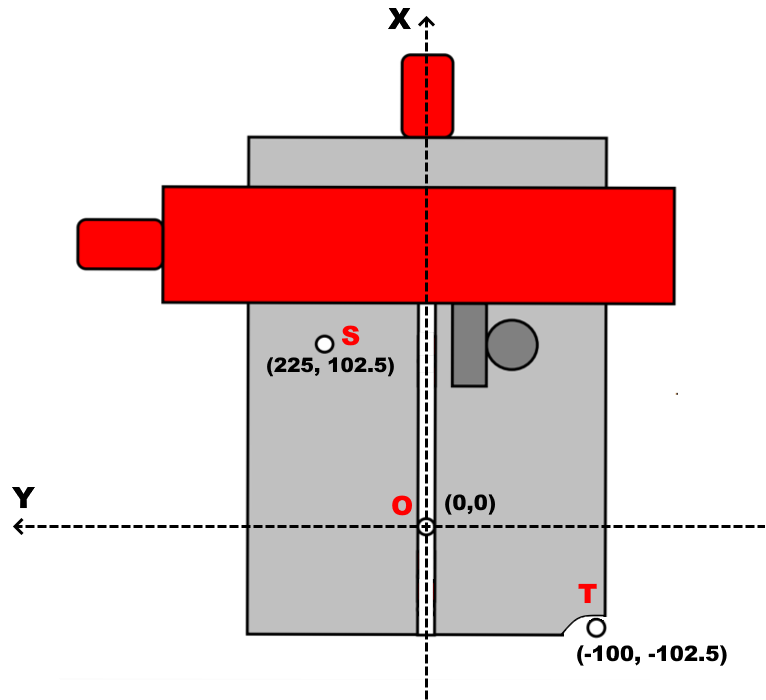
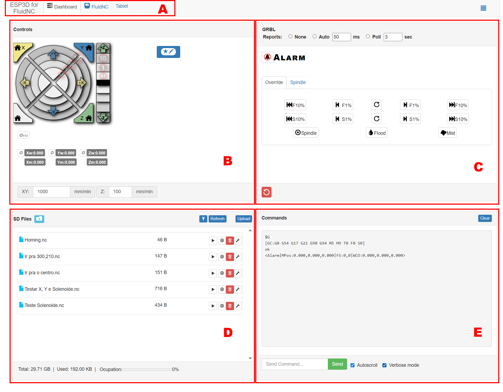

# Primeiros Passos 

## 1) Conhecendo a Máquina

#### Principais Partes da Máquina
- Eixos X e Y - Controlado por Motores de Passo
- Eixo Z - Controlado por Solenoide
- Spindle
- Limitador de Profundidade
    
#### Orientação e Posicionamento

 
- Posições:
    - O: Origem da Máquina (0,0)
    - T: Posição para troca de ferramenta
    - S: Posição para liberar aréa da placa
- Limites
    - Eixo X: de -100.0 até 225.0
    - Eixo Y: de -102.5 até 102.5

## 2) Conhecendo o Firmware FluidNC
### 2.1) Como se comunicar com o FluidNC
Ao ligar a placa mks vai aparecer a rede FLuidNC de senha 12345678, conecte-se a ela.  
Após isso, ao abrir o navegador ele ja deve redirecionar para a página com a interface web, mas se não redirecionar acesse fluidnc.local ou 192.168.0.1 para acessa-la.

### 2.2) Interface WEB

A interface WEB é dividida nas seguintes regiões:

- Região A – Menu Superior: Fornece acesso às seções de configuração geral do FluidNC, permitindo visualizar e editar o arquivo config.yaml, no qual estão definidas todas as parametrizações do firmware.
- Região B – Controle de Posicionamento: Apresenta, em tempo real, as coordenadas atuais dos eixos e disponibiliza controles manuais para movimentação da máquina.
- Região C – Controle de Estado: Responsável pelo gerenciamento do estado operacional. O FluidNC inicia, por padrão, no modo Alarm, impedindo qualquer movimento por segurança. Nessa região, é possível destravar a máquina, alterando o estado para Idle.
- Região D – Gerenciamento de Arquivos: Exibe o conteúdo armazenado no cartão SD e permite enviar, organizar e executar arquivos G-code diretamente pela interface.
- Região E – Console de Comunicação: Mostra o log de comunicação entre o firmware e o host, permitindo o envio manual de comandos em G-code e o monitoramento da execução em tempo real.

➡️ Próximo tutorial:  
[02 - Operações Básicas - Como Operar a Fresadora](02_operacoes_basicas.md)  