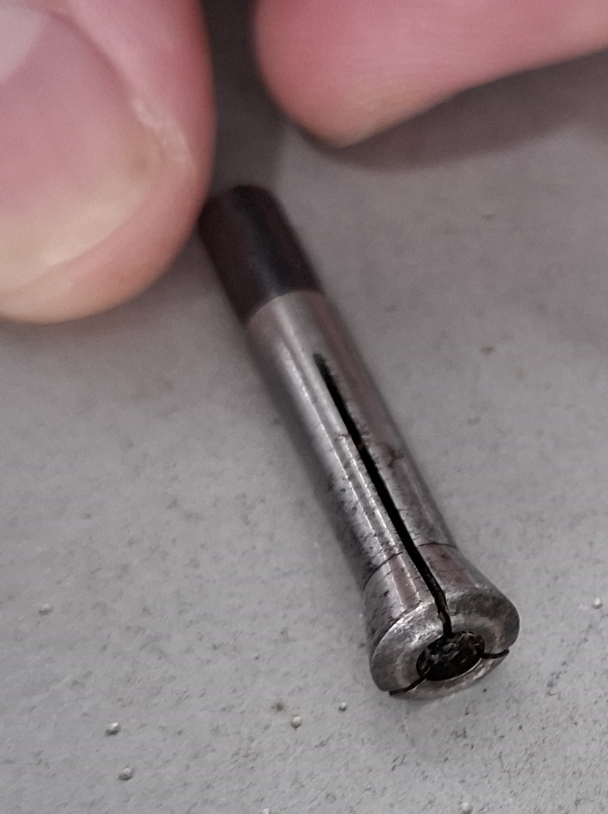
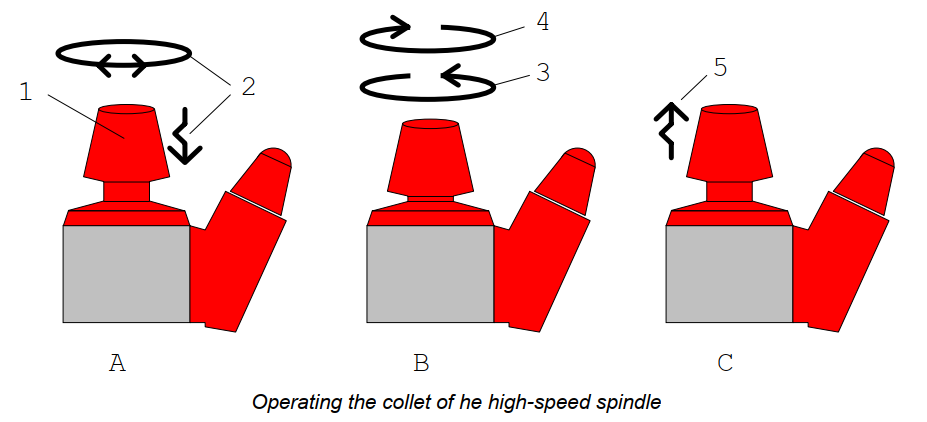

# Operações Básicas - Como Operar a Fresadora

## 1) 🔌 Ligando a Máquina na Ordem Correta
1. Ligar a placa MKS DLC32
2. Ligar o Arduino Uno
3. Ligar fonte de bancada (32V,5A) - Ela alimenta os drivers dos eixos x, y e o solenoide do eixo Z
4. Ligar o aspirador do spindle
5. Ligar o cabo de alimentação da LPKF numa tomada 220V (alimenta a placa do spindle)

## 2) Fazendo Homing
Basta usar o comando ```$H``` no console do FluidNC que a máquina irá fazer homing para se localizar.
> Recomenda-se sempre fazer homing quando ligar a máquina


## 3) Como prender a placa na máquina
Para prender a placa na máquina é necessário ...

### 3.1) Como Encontrar a posição certa
Vai depender do gcode do seu arquivo

Se os gcodes foram criados pelo kicad (ou outros CADs) vai depender da posição usada como origem no programa.

### 3.2) Base de Sacrifício
A placa antes de ser usinada precisa ser presa num material de sacrificio de 2mm de espessura.
A base de sacrificío que o manual recomenda é um pedaço de papelão.

### 3.3) Como fixar na posição
1. Mova a máquina para a posição de troca de ferramenta
2. Pressione....


## 4) Trocar Ferramenta
1. Mova a máquina pra posição de troca de ferramenta
2. Empurre o knuk (1) do spindle pra baixo para ele travar. Isso vai permitir apertar e soltar a ferramenta.  
<br>
3. Gire no sentido anti-horário para ir afroxando a pinça até ela junto com a ferramenta cairem na sua mão.
>  Se deixa-los cair sem segura-los tem grande chance de quebrar a ferramenta que tiver na pinça.

4. Tire a ferramenta que estiver na pinça com cuidado e guarde-o de forma segura. A imagem abaixo mostra a pinça do spindle sem nenhuma ferramente acoplada.  
<br>

> Jamais perca a pinça do spindle!  
Não existe essa peça pra comprar e o spindle não serve sem ela!


5. Coloque a ferramenta desejada. 


<br>


## 5) Como Ajustar o Limitador de Profundidade
<br>

O ajuste é realizado girando o disco serrilhado mostrado acima

|           Direção             |   Ponta da Ferramenta       | Rasgo na PCB   |
|-------------------------------|-----------------------------|----------------|
| Girar para Direita (UP)       | Sobe                        | Menos Profundo |
| Girar para Esquerda (DOWN)    | Desce                       | Mais Profundo  |

### Instruções:
1. Mova a máquina para próximo da pcb e MANUALMENTE mova o solenoide pra baixo e veja se a profundidade está adequada.
    > Muito cuidado para não mover o eixo Z e abaixar o solenoide pois **quebra a ferramenta!**
2. Gire o limitador de Profundidade até encontrar a profundidade adequada.

#### Profundidade para Fresar (Usando Fresa)
A fresa precisa atravessar completamente a camada de cobre (75um de espessura) da placa para isolar as trilhas.  
Mas não pode ir muito fundo pois força demais a ferramenta e a **fresa vai quebrar**.

> Dica: Pode-se usar o script de testar_profundidade.nc para fazer um rasgo de 1cm na placa e verificar se está bom sem tanto risco de quebrar a fresa.

#### Profundidade para Furar (Usando Broca)
A broca precisa atravessar completamente a placa (1600um) e chegar até o material de sacrifício sob a placa.  
Se tentar furar sem o material de sacrificio em baixo da placa a **broca vai quebrar** ao tocar na base de alumínio.

## 5) Como Ligar Spindle na Velocidade Correta

Primeiramente precisa-se saber qual a velocidade indicada de acordo com o tipo, diâmetro da ferramenta e do material da placa. Para isso usamos a tabela abaixo.

#### Tabela RPM Recomendada:
Em cada célula há 2 valores, que correspondem respectivamente a velocidade indicada para o material FR-1 e a para FR-4.  
FR-1 são as placas feitas de fenolite (macias) e FR-4 são as placas feitas de fibra de vidro (muito duro)

| Diâmetro (mm) | Broca – RPM recomendada           | Fresa – RPM recomendada   |
|---------------|-----------------------------------|---------------------------|
| 1,20 mm       | 22.000 – 32.000                   | 30.000 – 40.000           |
| 1,10 mm       | 24.000 – 35.000                   | 35.000 – 40.000           |
| 1,00 mm       | 26.000 – 38.000                   | 42.000 – 50.000           |
| 0,90 mm       | 28.000 – 42.000                   | 48.000 – 55.000           |
| 0,80 mm       | 32.000 – 50.000 (até 60k)         | 55.000 – 60.000           |
| 0,70 mm       | 36.000 – 55.000                   | 58.000 – 60.000           |
| 0,60 mm       | 40.000 – 60.000                   | 60.000 (máx.)             |
| 0,50 mm       | 50.000 – 60.000                   | 60.000 (máx.)             |
| 0,40 mm       | 55.000 – 60.000                   | 60.000 (máx.)             |
| 0,30 mm       | 60.000 (máx.)                     | 60.000 (máx.)             |


> **OBS: Nunca ligue a LPKF na tomada sem estar com o arduino Uno ligado!**

>**OBS: NUNCA USE O SPINDLE SEM UM ASPIRADOR CONECTADO!**<br>
Ele é usada pra resfriar o motor


➡️ Próximo tutorial:  
[03 - Usando GCodes e Controlando a Máquina](03_usando_gcodes.md)  


---

> ⚠️ **Aviso sobre material de terceiros**
>
> Algumas imagens utilizadas neste tutorial foram extraídas do manual original da fresadora **LPKF ProtoMat C60**, pertencente à **LPKF Laser & Electronics AG**.
>
> O uso dessas imagens tem finalidade **exclusivamente educacional**, sem fins comerciais.
>
> Todos os direitos pertencem aos seus respectivos autores.
