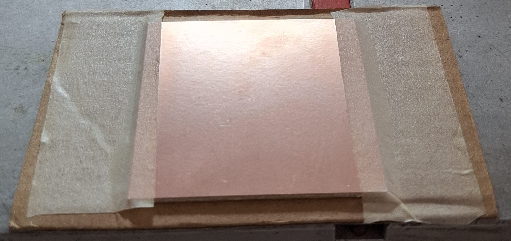
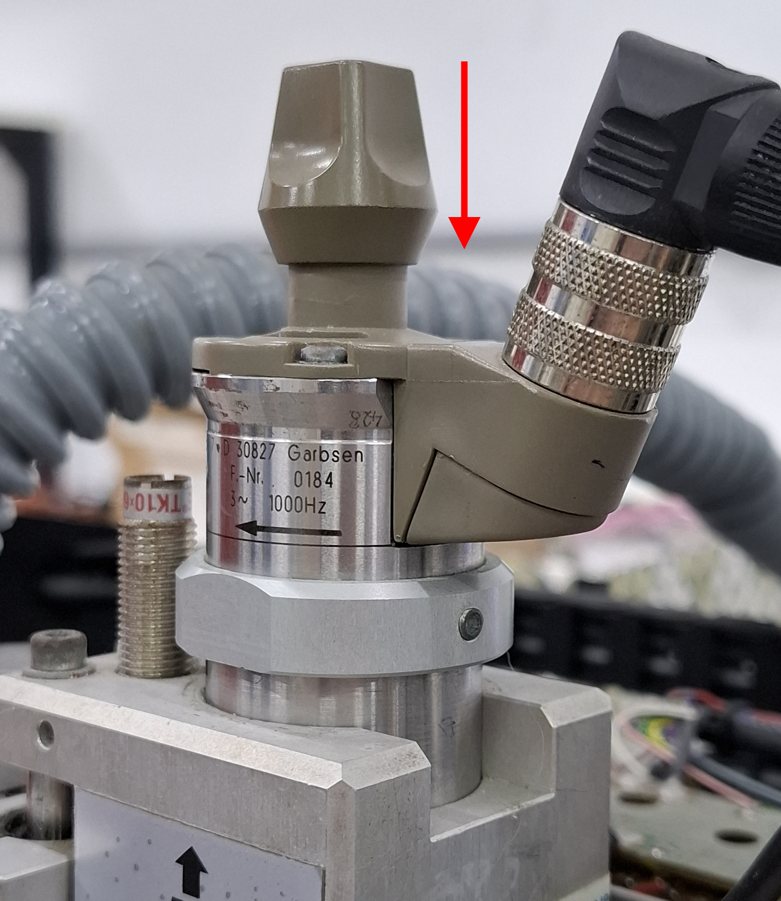
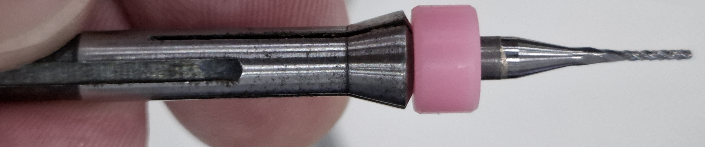
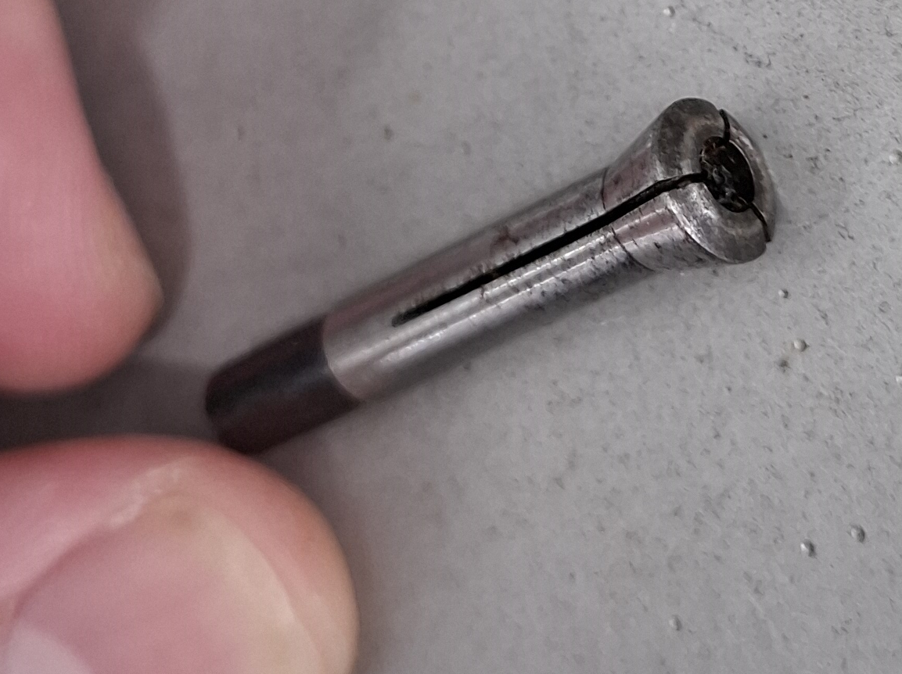
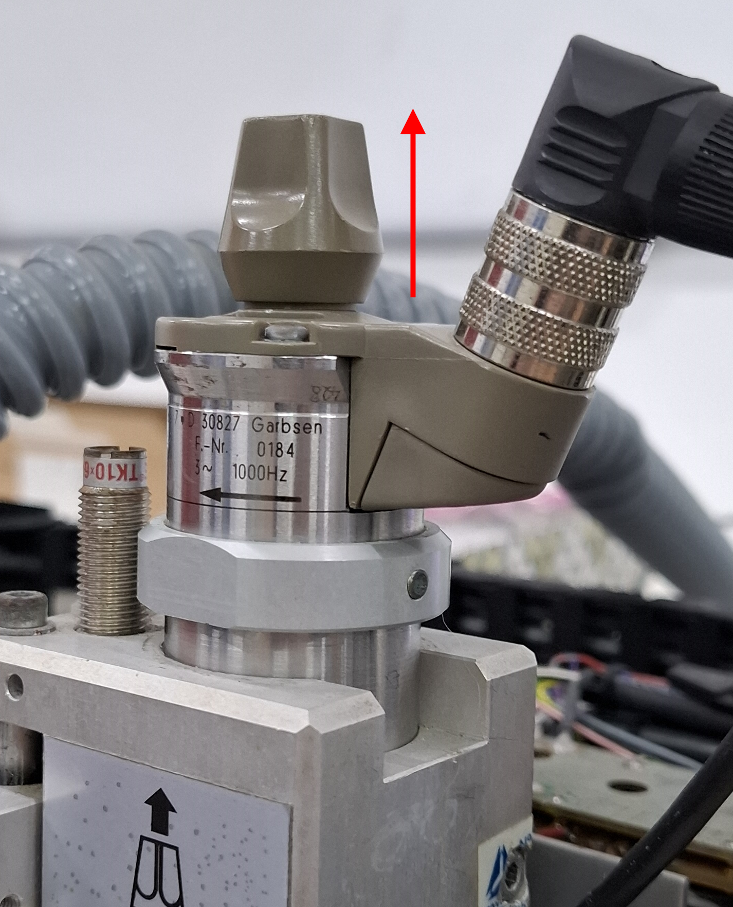

# Operações Básicas - Como Operar a Fresadora

## 1) 🔌 Ligando a Máquina na Ordem Correta
1. Ligar a placa MKS DLC32
2. Ligar o Arduino Uno
3. Ligar fonte de bancada (32V,5A) - Ela alimenta os drivers dos eixos x, y e o solenoide do eixo Z
4. Ligar o aspirador do spindle
5. Ligar o cabo de alimentação da LPKF numa tomada 220V (alimenta a placa do spindle)

## 2) Fazendo Homing
> Sempre faça homing após ligar a máquina!

Basta usar o comando ```$H``` no console do FluidNC que a máquina irá fazer homing para se localizar.

## 3) Como prender a placa na máquina
### 3.1) Como Encontrar a posição certa
* A posição onde deve ser colocada a placa depende dos gcodes do seu projeto.
* Se os gcodes foram criados pelo kicad (ou outros CADs) vai depender da posição usada como origem no programa.

> Se não faz ideia da posição que deve ficar a placa, tire a placa e tudo da base da máquina e execute o gcode que contem o contorno da placa para descobrir onde sua placa deve ficar.

### 3.2) Base de Sacrifício
A placa antes de ser usinada precisa ser presa num material de sacrificio de 2mm de espessura (não pode ser muito espessa).
A base de sacrificío que o manual recomenda é um pedaço de papelão.
<figure align="center">
  
  <figcaption>
    <em>Placa presa à base de sacrifício de papelão</em>
  </figcaption>
</figure>

### 3.3) Como fixar na posição
1. Mova a máquina para a posição de liberar área da placa
2. Coloque a base de sacrifício na mesa e a placa sobre ela, de forma que a placa fique na posição correta de onde será usinado
3. Com fita gomada prenda a placa e a base de sacrifício nesta posição de forma que fique bem fixo.
<figure align="center">

  <figcaption>
    <em>Placa e base de sacrifício presas na base da máquina usando fita gomada</em>
  </figcaption>
</figure>


## 4) Trocar Ferramenta
1. Mova a máquina pra posição de troca de ferramenta
2. Empurre o knuk do spindle pra baixo para ele travar. <br>
Isso vai permitir apertar e soltar a ferramenta.  
    <figure align="center">
      
    <figcaption>
        <em>Travando o eixo do spindle</em>
    </figcaption>
    </figure>

3. Gire no sentido anti-horário para ir afroxando a pinça até ela junto com a ferramenta cairem na sua mão.
    >  Se deixa-los cair sem segura-los tem grande chance de quebrar a ferramenta que tiver na pinça.
    <figure align="center">
      
    <figcaption>
        <em>Pinça com a fresa acoplada após tira-las do spindle</em>
    </figcaption>
    </figure>

4. Tire a ferramenta que estiver na pinça com cuidado e guarde-o de forma segura. A imagem abaixo mostra a pinça do spindle sem nenhuma ferramenta acoplada.  
    > **Jamais perca a pinça do spindle!**  
    Não existe essa peça pra comprar e o spindle não serve sem ela!
    <figure align="center">
      
    <figcaption>
        <em>Pinça sem ferramenta acoplada</em>
    </figcaption>
    </figure>

5. Coloque a ferramenta desejada na pinça e insira-os de volta no spindle.
Atenção: A pinça so entra de um jeito no spindle, então tem que ficar segurando
a ferramenta com cuidado com os dedos enquanto vai girando ela até ela entrar direito.
Após entrar é só girar o knut pro sentido horário até o final para ele prender a ferramenta
    <figure align="center">
      
    <figcaption>
        <em>Botando a pinça com a fresa no spindle</em>
    </figcaption>
    </figure>

    > **OBS1**: Se o knut ao girar não segurar a pinça é porque você não conseguiu botar a pinça do jeito correto.  
    > **OBS2**: Havia uma peça que veio com a máquina pra facilitar colocar a pinca de volta mas perderam ela a muito tempo. Por isso é bem chato de se prender a ferramenta de volta mas com persistência e calma dá certo.
    
6. Empurre o knuk do spindle pra cima para ele destravar o eixo do spindle <br>
    <figure align="center">
      
    <figcaption>
        <em>Destravando o eixo do spindle</em>
    </figcaption>
    </figure>


## 5) Como Ajustar o Limitador de Profundidade
    <figure align="center">
    <br>
    <figcaption>
        <em>Disco que regula o limitador de profundidade</em>
    </figcaption>
    </figure>

O limitador de profundidade é esse "copo" que fica ao redor da ferramenta no spindle. Ao girar o disco serrilhado esse copo sobe/desce para expor/esconder mais a ponta da ferramenta, permitindo regular o quão profundo a ferramenta entra na PCB.

O ajuste da profundidade é realizado girando o disco serrilhado indicado na figura acima da seguinte forma:

|           Direção             |   Ponta da Ferramenta       | Rasgo na PCB   |
|-------------------------------|-----------------------------|----------------|
| Girar para Direita (UP)       | Sobe                        | Menos Profundo |
| Girar para Esquerda (DOWN)    | Desce                       | Mais Profundo  |


### Instruções:
1. Mova a máquina para próximo da PCB e **manualmente** mova o solenoide pra baixo e veja se a ponta da ferramenta atinge a profundidade adequada.
    > Muito cuidado para não mover o eixo Z e abaixar o solenoide pois **quebra a ferramenta!**

2. Gire o limitador de Profundidade até encontrar a profundidade adequada pro tipo de operação que vai realizar.

#### Profundidade para Fresar (Usando Fresa)
A fresa precisa atravessar completamente a camada de cobre (75um de espessura) da placa para isolar as trilhas.  
Mas não pode ir muito fundo pois força demais a ferramenta e a **fresa vai quebrar**.

> Dica: Pode-se usar o script de testar_profundidade.nc para fazer um rasgo de 1cm na placa e verificar se está bom sem tanto risco de quebrar a fresa.

#### Profundidade para Furar (Usando Broca)
A broca precisa atravessar completamente a placa (1600um) e chegar até o material de sacrifício sob a placa.  
Se tentar furar sem o material de sacrificio em baixo da placa a **broca vai quebrar** ao tocar na base de alumínio.

--- 
➡️ Próximo tutorial:  
[03 - Controlando a máquina com G-codes](03_gcodes_basico.md)  

[⬅ Voltar para Tutoriais](../README.md#tutoriais)

---
> Licença: MIT — consulte [`LICENSE`](../LICENSE).
