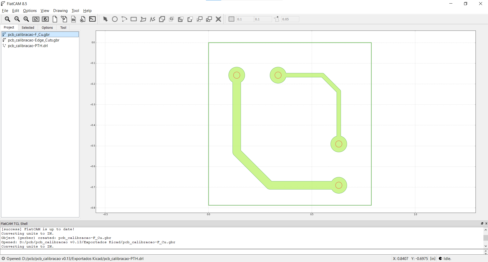
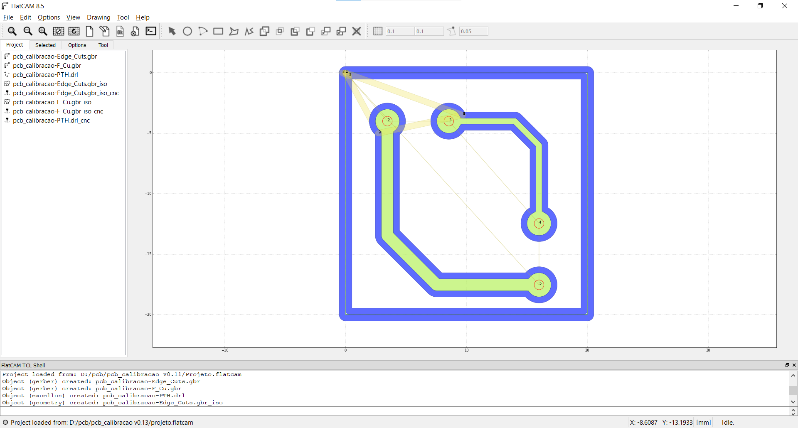

# Gerando G-codes a partir de um projeto CAD
Este tutorial descreve o processo, desde a exportação dos **arquivos Gerbers e Excellon** do projeto no **KiCad**, até a conversão desses arquivos em **G-code no FlatCAM**.

Antes de iniciar, defina claramente os parâmetros do projeto:
> ⚠️ Estes valores impactam diretamente as regras de projeto e as configurações no FlatCAM.

* **Df** → Diâmetro da Fresa
* **Db** → Diâmetro da Broca


---

## Parte 1 — KiCad
> Para este projeto foi usado o KiCad mas o procedimento é basicamente o mesmo com outros programas de CAD: Basta extrair os arquivos Gerbers e o Excellon para usar depois no FlatCAM.

Não será detalhado a parte de criação e configurações do projeto da PCB, apenas como se exporta os arquivos que serão usados.

### Gerando os arquivos Gerbers e Excellon
1. Abra o Editor de PCI (PCB se tiver inglês)
2. Vá em `Arquivo → Plote`
3. Em Formato da plotagem use `Gerber`
4. Em Inclua camadas selecione: `Edge.cuts` e `F.Cu`
5. Clique no botão `Plote`
6. Em seguida clique no botão `Cria arquivos de perfuração`
7. Na janela que abrir clique no botão `Gera um arquivo de perfuração`
8. Feche as duas janelas que haviam aberto, feche o editor de PCI e volte pra tela principal do Kicad.


#### Arquivos que serão Usados:
Agora vão ter aparecido na pasta do projeto vários arquivos, os que usaremos são os cujo o nome terminam com: 
* `...Edge_Cuts.gbr` - Contém o contorno da placa
* `...F_Cu.gbr` - Contém as trilhas da Placa
* `...PTH.drl` - Contém os furos da placa


---
## Parte 2 — FlatCAM
Para este tutorial foi utilizado o FlatCAM 8.5.

### 1) Preparação
Antes de começar copie os arquivos que serão usados descritos acima para uma nova pasta no disco C de nome simples, pois o FlatCAM tem problemas pra acessar pastas longas ou com simbolos no caminho.

#### Abrindo os arquivos
1. Abra o **FlatCAM**
2. `File → Open Gerber` → selecione o arquivo `F.Cu.gbr`
3. `File → Open Gerber` → selecione o arquivo `Edge.Cuts.gbr`
4. `File → Open Excellon` → selecione o arquivo `PTH.drl`

<figure align="center">
  
  <figcaption>
    <em>Flatcam após importar gerbers e excellon</em>
  </figcaption>
</figure>

--- 
### 2) Gerando o G-code com as Trilhas
1. Selecione o Gerber do arquivo `F.Cu.gbr` na aba **Project**, em seguida, clique na aba **Selected**.  
2. Na sessão **Isolation Routing** configure os seguintes parâmetros:
    - **Tool dia.**: = `Df` = Diâmetro da Fresa  
3. Clique em: `Generate Geometry` em seguida volte pra aba **Project**
4. Na aba **Project** selecione a Geometria criada (termina com `F_Cu.gbr_iso`), em seguida, clique na aba **Selected**.
5. Na sessão **Create CNC Job** defina os seguintes parâmetros:
    - **Cut Z:** `-0.1 mm`
    - **Travel Z:** `2.0 mm`
    - **Feed rate:** `100`
    - **Spindle speed:** Depende do diametro da ferramenta
6. Clique em: ```Generate```, em seguida, volte pra aba **Project**
7. Clique no CNCjob criado (termina com `F_Cu.gbr_iso_cnc`) e volte pra aba **Selected**
8. Clique em `Export G-code` e salve o arquivo no local desejado.


--- 
### 3) Gerando o G-code com os Furos
1. Selecione o arquivo Excellon `PTH.drl` na aba **Project**, em seguida, clique na aba **Selected**.  
2. Na sessão **Create CNC Job** configure os seguintes parâmetros:  
    - **Cut Z:** `-1.8 mm`  
    - **Travel Z:** `2.0 mm`  
    - **Feed rate:** `100`  
    - **Spindle speed:** Depende do diametro da ferramenta  
3. Na sessão **Tools** selecione na tabela o diâmetro da broca que será usada.  
Os diâmetros desta tabela são obtidos a partir do arquivo excellon gerado pelo CAD, por isso podem ter vários diâmetros diferentes de acordo com os componentes usados.
    > Para fazer furos de diferentes diâmetros é necessário selecionar 1 diâmetro por vez e repetir o procedimento para exportar 1 gcode pra cada broca que será usada.  

    > Se os diâmetros das brocas forem parecidos pode-se usar ctrl+a na tabela para selecionar todos os diâmetros e usar a mesmo broca pra furar todos eles.  
4. Na sessão **Export G-Code** clique em `Export G-code` e salve o arquivo no local desejado.

---
### 4) Gerando o G-code com o Contorno da Placa
1. Selecione o Gerber do arquivo `Edge.Cuts.gbr` na aba **Project**, em seguida, clique na aba **Selected**.  
2. Na sessão **Board cutout** configure os seguintes parâmetros:
    - **Tool dia.:** `Df` = Diâmetro da Fresa  
    - **Margin:** `0.4 mm`  
    - **Gap Size:** `3.0 mm`  
    - **Gaps:** `4`  
3. Clique em: `Generate Geometry` em seguida volte pra aba **Project**
4. Selecione a Geometria criada (termina com `Edge.Cuts.gbr_cutout`), em seguida, clique na aba **Selected**.
5. Na sessão **Create CNC Job** defina os seguintes parâmetros:
    - **Cut Z:** `-1.8 mm`
    - **Travel Z:** `2.0 mm`
    - **Feed rate:** `150.0`
    - **Tool dia.:** `Df` = Diâmetro da Fresa  
    - **Spindle speed:** Depende do Diametro da Fresa
    - **Multi-Depth rate:** `Desativado`
6. Clique em: ```Generate```, em seguida, volte pra aba **Project**
7. Clique no CNCjob criado (termina com `Edge.Cuts.gbr_cutout_cnc`) e volte pra aba **Selected**
8. Clique em `Export G-code` e salve o arquivo no local desejado.

### 5) Finalizando
Salve o projeto do FlatCAM numa pasta no disco C de nome simples, pois o FlatCAM tem problemas pra exportar pra pastas longas ou com simbolos no caminho. Se ela não salvar o projeto na pasta que você pediu é porque o caminho dessa pasta não é compatível com o FLatCAM.


<figure align="center">
  
  <figcaption>
    <em>Flatcam após exportar G-codes da placa</em>
  </figcaption>
</figure>


---
<br>  

---


### Velocidade Recomendada pro Spindle
> OS VALORES ABAIXO SÃO APENAS UMA SUGESTÃO, só tive experiencia com 2 diametros diferentes.

Primeiramente precisa-se saber qual a velocidade indicada de acordo com o tipo, diâmetro da ferramenta e do material da placa. Para isso usamos a tabela abaixo.

#### Tabela RPM Recomendada:
Em cada célula há 2 valores, que correspondem respectivamente a velocidade indicada para o material FR-1 e a para FR-4.  
FR-1 são as placas feitas de fenolite (macias) e FR-4 são as placas feitas de fibra de vidro (muito duro)

| Diâmetro (mm) | Broca – RPM recomendada           | Fresa – RPM recomendada   |
|---------------|-----------------------------------|---------------------------|
| 1,20 mm       | 22.000 – 32.000                   | 30.000 – 40.000           |
| 1,10 mm       | 24.000 – 35.000                   | 35.000 – 40.000           |
| 1,00 mm       | 26.000 – 38.000                   | 42.000 – 50.000           |
| 0,90 mm       | 28.000 – 42.000                   | 48.000 – 55.000           |
| 0,80 mm       | 32.000 – 50.000 (até 60k)         | 55.000 – 60.000           |
| 0,70 mm       | 36.000 – 55.000                   | 58.000 – 60.000           |
| 0,60 mm       | 40.000 – 60.000                   | 60.000 (máx.)             |
| 0,50 mm       | 50.000 – 60.000                   | 60.000 (máx.)             |
| 0,40 mm       | 55.000 – 60.000                   | 60.000 (máx.)             |
| 0,30 mm       | 60.000 (máx.)                     | 60.000 (máx.)             |


> **OBS: Nunca ligue a LPKF na tomada sem estar com o arduino Uno ligado!**

>**OBS: NUNCA USE O SPINDLE SEM UM ASPIRADOR CONECTADO!**<br>
Ele é usada pra resfriar o motor


---

## ✅ Observações finais

* O **KiCad prepara o layout**
* O **FlatCAM define as ferramentas (Df e Db)**
* Sempre revise visualmente o G-code antes de usinar

Este fluxo foi validado para uso em fresadora de PCBs retrofitada.


<br><br>

---
<p>
  <a href="../README.md#tutoriais">⬅ Voltar para Tutoriais</a>
  <span style="float:right">
    <a href="05_usinagem.md">Próximo Tutorial ➡️</a>
  </span>

---
> Licença: MIT — consulte [`LICENSE`](../LICENSE).
